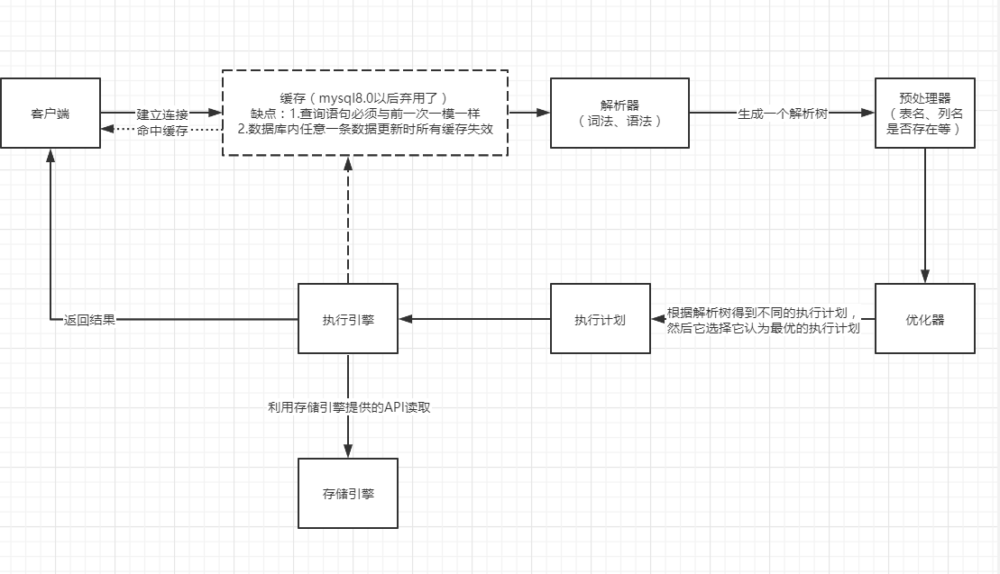

# 奔跑吧兄弟

## 今日作业 

> 2019-09-24 

### 用文字或者图片简述一个查询语句的执行流程

 

### 为什么写入redo log 和binlog要用两阶段提交（XA）呢？或者说，如果直接写入redo log成功，再去写bin log，可能会出现什么问题？
	通过这种方式，可以让InnoDB和Binlog中的事务状态保持一致。如果在写入innodb commit标志时崩溃，则恢复时，会重新对commit标志进行写入；
	在prepare阶段崩溃，则会回滚，在write/sync binlog阶段崩溃，也会回滚。
